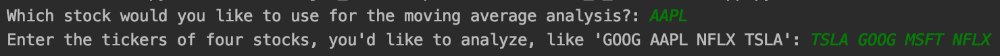
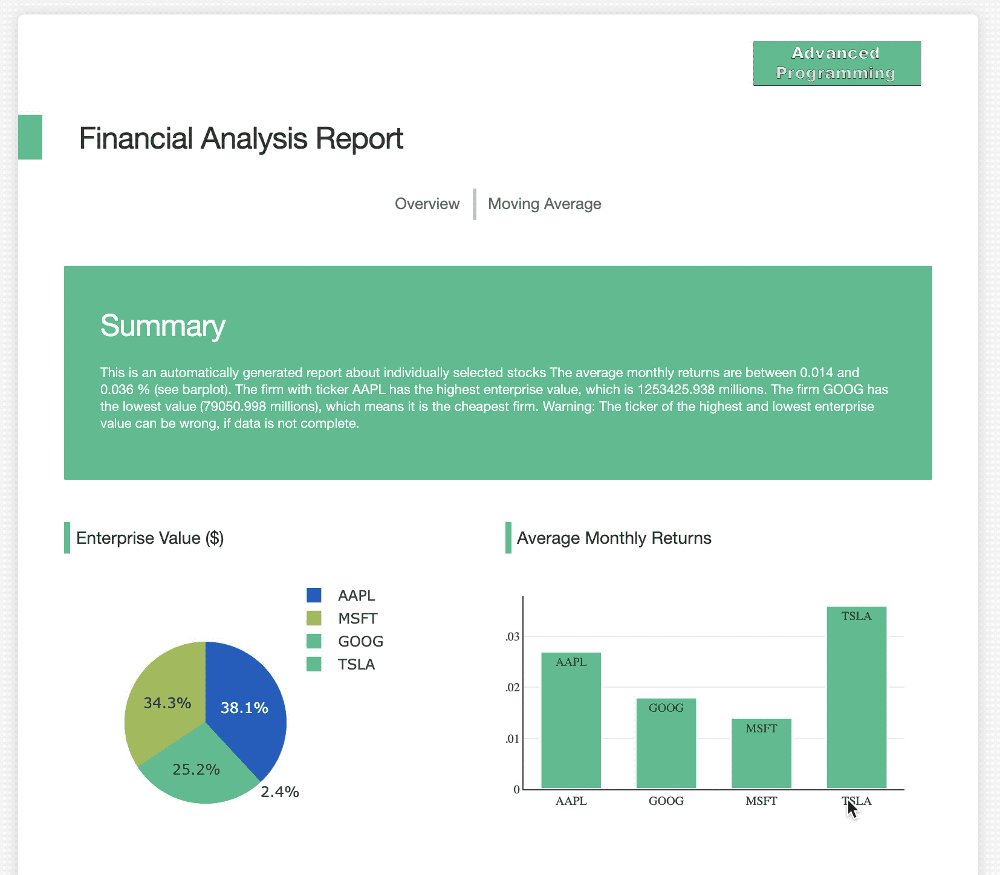

# Financial Stock Analysis Report

This is a demo of the [Dash](https://plot.ly/products/dash/) interactive Python framework developed by [Plotly](https://plot.ly/).

Dash abstracts away all of the technologies and protocols required to build an interactive web-based application and is a simple and effective way to bind a user interface around your Python code. To learn more about Dash, take a look at our [documentation](https://dash.plot.ly). If you're interested in deploying this application, check out [Dash Deployment Server](https://dash.plot.ly/dash-deployment-server/) - Plotly's commercial offering for hosting and sharing Dash Apps on-premise or in the cloud.

## Getting Started

### Running the app locally

First create a virtual environment and clone the git repo.
Then install the requirements with pip

```

git clone https://github.com/jan4j/Automatic-Stock-Analysis-Report.git
cd Automatic-Stock-Analysis-Report
pip3 install -r requirements.txt

```

Run the app

```

python3 app.py

```

## About the app

This is an interactive, multi-page report which displays a number of tables and interactive plots in a report format. The app automatically loads the data from yahoo finance.
When you execute the app you will first be asked which stocks you want to have analyzed and from which one you want an investment advice based on chart analysis.
Please always input 4 stock tickers and only 1 ticker for moving average analysis.
It may takes some time after execution until you get the local host adress with the web report since the data will be loaded from yahoo.




## Built With

- [Dash](https://dash.plot.ly/) - Main server and interactive components
- [Plotly Python](https://plot.ly/python/) - Used to create the interactive plots

The following is a screenshot of the app in this repo:



